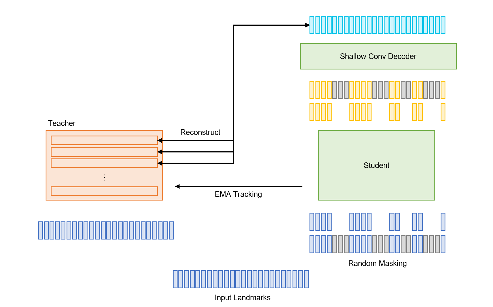
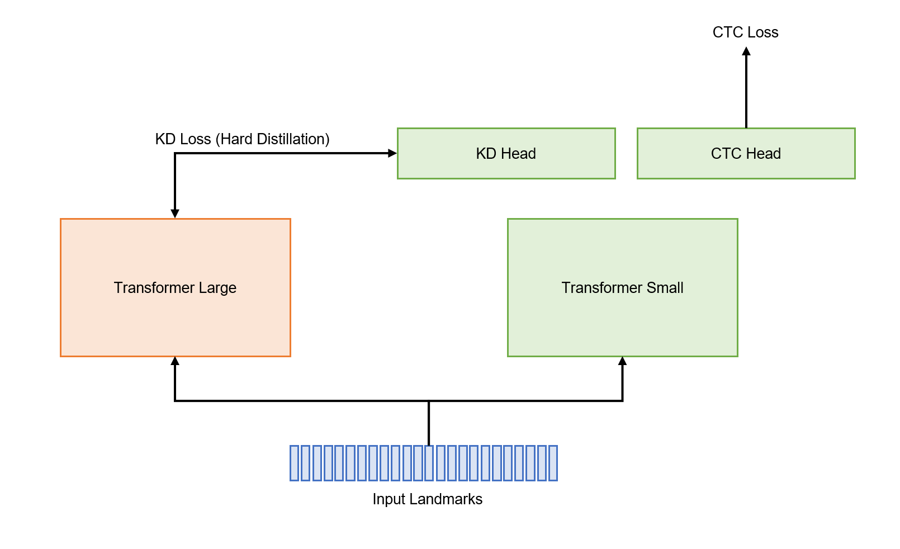
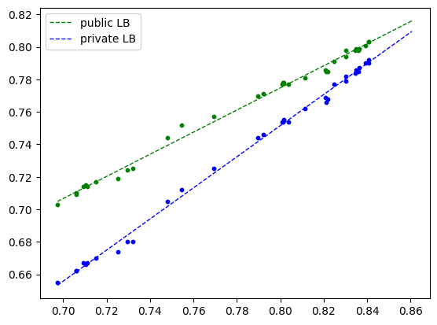

# Google - American Sign Language Fingerspelling Recognition
## Introduction
This repository is the 5th place solution of [Google - American Sign Language Fingerspelling Recognition](https://www.kaggle.com/competitions/asl-fingerspelling/overview) competition. It contains the entire training and inference codes which truly used to achieve 5th place on the final leaderboard and can be used to replicate my performance. Check out the detailed explanation of my solution on [this post](https://www.kaggle.com/competitions/asl-fingerspelling/discussion/434415) or [the below section](#solution-explanation).

## Requirements
This code requires the below libraries:
* chex==0.1.7
* flax==0.7.1
* jax==0.4.13
* optax==0.1.5
* mediapipe
* numpy
* pandas
* python_Levenshtein
* scikit_learn
* scipy
* tensorflow
* tflite_runtime
* torch
* wandb

You can install them simply by using the below:
```bash
$ pip install -r requirements.txt
```

## License
This repository is licensed under [Apache 2.0](./LICENSE).

## Solution Explanation
You can also see the [solution post](https://www.kaggle.com/competitions/asl-fingerspelling/discussion/434415) in the competition discussion forum.

### TL;DR
* Using hands, pose, and lips landmarks with 3D-based strong augmentation
* Vanilla transformer with conv stem and RoPE
* Data2vec 2.0 pretraining
* CTC segmentation and CutMix
* Knowledge distillation

### Data Processing
I used 3d landmark points instead of 2d coordinate because it looks like applying rotation augmentation on 3d space makes models to be more robust. According to [the mediapipe documentation](https://developers.google.com/mediapipe/api/solutions/java/com/google/mediapipe/tasks/components/containers/NormalizedLandmark), the magnitude of z uses roughly the same scale as x. Since x and y are normalized by width and height of camera canvas and they are recorded on smartphone devices, I have to denormalize the landmarks with original aspect ratio to apply correct rotation transform. I simply estimate the aspect ratio by solving affine matrix that maps to the normalized hands at each frame to the standard hand landmarks and get scale factors from the affine matrix. The average aspect ratio is `0.5268970670149133` and I simply multiply `1.8979039030629028` to the normalized y values, i.e., `points *= np.array([1, 1.8979039030629028, 1])`.

Correct Rotation Transform: $X' = SRX$

Wrong Rotation Transform: $X' = RSX$

It's important to note that applying rotation after normalizing coordinates is incorrect. Denormalize, rotate, and then normalize again. Actually, I did not normalize again because it is not necessary.

For inputs, I utilized landmarks from the left hand, right hand, pose, and lips.  Initially, I focused solely on hand landmarks for the first few weeks and achieved a public LB score of 0.757. I believed fingerspelling is totally related to hand gestures only. Surprisingly, incorporating auxiliary landmarks such as pose and lips leads better performance and helped mitigate overfitting. The inclusion of additional input points contributed to better generalization.

Here's a snippet of the data augmentation code I employed for both pretraining and finetuning:
```python
Sequential(
    LandmarkGroups(Normalize(), lengths=(21, 14, 40)),
    TimeFlip(p=0.5),
    RandomResample(limit=0.5, p=0.5),
    Truncate(max_length),
    AlignCTCLabel(),
    LandmarkGroups(
        transforms=(
            FrameBlockMask(ratio=0.8, block_size=3, p=0.1),
            FrameBlockMask(ratio=0.1, block_size=3, p=0.25),
            FrameBlockMask(ratio=0.1, block_size=3, p=0.25),
        ),
        lengths=(21, 14, 40),
    ),
    FrameNoise(ratio=0.1, noise_stdev=0.3, p=0.25),
    FeatureMask(ratio=0.1, p=0.1),
    LandmarkGroups(
        Sequential(
            HorizontalFlip(p=0.5),
            RandomInterpolatedRotation(0.2, np.pi / 4, p=0.5),
            RandomShear(limit=0.2),
            RandomScale(limit=0.2),
            RandomShift(stdev=0.1),
        ),
        lengths=(21, 14, 40),
    ),
    Pad(max_length),
)
```
The total number of input points is 75. Each component consists of 21, 21, 14, and 40 points, respectively. The hand with more `NaN` values is discarded and only the dominant hand is selected. As seen in the snippet above, spatial transformations are applied separately to the components. The landmark groups are first centered and normalized by maximum x-y values of each group. Note that z-values can exceed 1.

### Model Architecture
I employed a simple Transformer encoder model similar to ViT. I used PreLN and rotary position embeddings. I replaced ViT's stem linear patch projection with a single convolutional layer. This alternation aimed to enable the model to capture relative positional differences, such as motion vectors, from the first convolutional layer. With the application of rotary embeddings, there is no length limit and also I didn't truncate input sequences at inference time. Similar to other ViT variants, I also integrated LayerDrop to mitigate overfitting.

### Data2vec 2.0 Pretraining
Given that the inputs consist of 3d points and I used a normal Transformer architecture which has low inductive bias toward data attributes, I guessed it is necessary to pretrain the model to learn all about data properties. The [Data2vec 2.0](https://arxiv.org/abs/2212.07525) method, known for its remarkable performance and efficiency across various domain, seemed promising for adaptation to landmark datasets.



According to the paper, using multiple different masks within the same batch helps convergence and efficiency. I set $M = 8$ and $R = 0.5$, which means 50% of the input sequences are masked and there are 8 different masking patterns. After I experimented many various models, and I arrived at the following final models:
* Transformer Large (24L 1024d): 109 epochs (872 effective epochs)
* Transformer Small (24L 256d): 437 epochs (3496 effective epochs)

Termination of the overall trainings was determined by training steps, not epochs, resulting in epochs that are not multiples of 10. After pretraining the model, the student parameters are used for finetuning.

### CTC Segmentation and CutMix
Before explaining the finetuning part, it is essential to discuss CTC segmentation and CutMix augmentation. Check out [this repository](https://github.com/lumaku/ctc-segmentation) and [this documentation](https://pytorch.org/audio/main/tutorials/forced_alignment_tutorial.html) which provide information about CTC segmentation. To summarize, a CTC-trained model can detect the position of character appearances, enabling the inference of time alignment between phrases and landmark videos.

Initially, I trained a Transformer Large model and created pseudo aligned labels. Using the alignments, I applied temporal CutMix augmentation which cuts random part of the original sequence and inserts a part from another random sequence at the cutting point. This technique significantly reduces overfitting and improves the performance approximately +0.02. Furthermore, I retrained the Transformer Large model with CutMix and pseudo-aligned labels like noisy student, and it achieved better performance on CV set.

Moreover, I observed that while supplemental datasets without CutMix degrades the performance, they provided substantial enhancement when used with CutMix, resulting in an improvement of about +0.01 on both CV and LB.

### Finetuning and Knowledge Distillation
The finetuning phase followed a standard approach. I simply utilized the CTC loss with augmentations mentioned above. Given the constraints of 40MB and 5 hours, the Transformer Large model was too extensive to be accommodated. I explored various combinations and parameter sizes, eventually setting on the Transformer Small (24L 256d) architecture. To compress the Large model into the Small model, I used knowledge distillation like DeiT to predict the hard prediction label from teacher model. I observed sharing same head for KD and CTC adversely affected the performance, so I used distinct heads. I also experimented with RNN-like heads (especially stacked BiLSTM) but there is no performance gain. It seems the model converges fast, but final performance is not changed.



The training epochs were as follows:
* Transformer Large (24L 1024d): 65 epochs
* Transformer Small (24L 256d): 830 epochs

### CV vs LB
Contrary to the standard validation strategy (GroupKFold) that many people used, I simply split 5% of the training set to validate the model performance.
```python
train_test_split(train_labels, test_size=0.05, random_state=42)
```
While I initially employed group kfold based on participant IDs, I encountered incongruities between cross-validation and public LB scores. The approach outlined above led to consistent improvements in both cross-validation and public LB performance.



### What Didn't Work & Future Work
- Using external datasets did not work. Actually, I realized competition dataset is quite large and it was really hard to find large scale fingerspelling set as this competition one.
- Although prefix beam search showed a modest enhancement of +0.002 even with a small beam size, my implementation in tflite version is too slow, and I didn't use it finally.
- I experimented with various head architectures, but a single linear layer was sufficient.
- Conformer and transformer encoder-decoder models were not better than vanilla transformer.
- I also tried RandAugment and TrivialAugment but hand-crafted strong augmentations worked well.